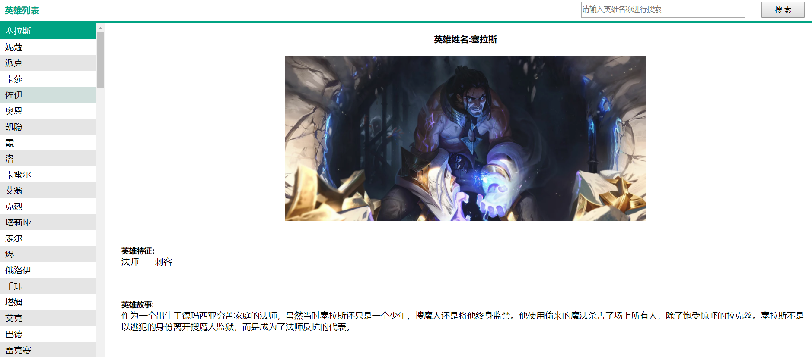

## 什么是Vue.js

- Vue.js 是目前最火的一个前端框架，React是最流行的一个前端框架（React除了开发网站，还可以开发手机App， Vue语法也是可以用于进行手机App开发的，需要借助于Weex）

- Vue.js 是前端的**主流框架之一**，和Angular.js、React.js 一起，并成为前端三大主流框架！

- Vue.js 是一套构建用户界面的框架，**只关注视图层**，它不仅易于上手，还便于与第三方库或既有项目整合。（Vue有配套的第三方类库，可以整合起来做大型项目的开发）

- 前端的主要工作？

  > 主要负责MVC中的V这一层；主要工作就是和界面打交道，来制作前端页面效果；

## 为什么要学习流行框架

- 企业为了提高开发效率：在企业中，时间就是效率，效率就是金钱；
- 提高开发效率的发展历程：原生JS -> Jquery之类的类库 -> 前端模板引擎 -> Angular.js / Vue.js（能够帮助我们减少不必要的DOM操作；提高渲染效率；双向数据绑定的概念【通过框架提供的指令，我们前端程序员只需要关心数据的业务逻辑，不再关心DOM是如何渲染的了】）

## 框架和库的区别

- 框架：是一套完整的解决方案；对项目的侵入性较大，项目如果需要更换框架，则需要重新架构整个项目。
- 库（插件）：提供某一个小功能，对项目的侵入性较小，如果某个库无法完成某些需求，可以很容易切换到其它库实现需求。

# （一）插值操作

## 1.1	Mustache语法

​	mustache是胡须的意思，因为`{{}}`像胡须，又叫大括号语法。

​	在vue对象挂载的dom元素中，`{{}}`不仅可以直接写变量，还可以写简单表达式。

```html
<!DOCTYPE html>
<html lang="en">
<head>
  <meta charset="UTF-8">
  <meta name="viewport" content="width=device-width, initial-scale=1.0">
  <meta http-equiv="X-UA-Compatible" content="ie=edge">
  <title>Mustache的语法</title>
</head>
<body>
  <div id="app">
    <h2>{{message}}</h2>

    <!-- Mustache的语法不仅可以直接写变量，还可以写简单表达式 -->
    <h2>{{firstName + lastName}}</h2>
    <h2>{{firstName + " " + lastName}}</h2>
    <h2>{{firstName}}{{lastName}}</h2>
    <h2>{{count * 2}}</h2>
  </div>
  <script src="https://cdn.jsdelivr.net/npm/vue/dist/vue.js"></script>
  <script>
    const app = new Vue({
      el:"#app",
      data:{
        message:"hello,world",
        firstName:"Kyrie ",
        lastName:"lrving",
        count:100
      }
    })

  </script>
</body>
</html>
```

## 1.2  v-once

​	v-once表示该dom元素只渲染一次，之后数据改变，不会再次渲染。

```html
  <div id="app">
    <h2>{{message}}</h2>
    <!-- 只会渲染一次，数据改变不会再次渲染 -->
    <h2 v-once>{{message}}</h2>

  </div>
```

​	上述`{{message}}`的message修改后，第一个h2标签数据会自动改变，第二个h2不会。

## 1.3 v-html（类似于innerHtml）

​	按照HTML格式进行解析，并且显示对应的内容。

```html
<!DOCTYPE html>
<html lang="en">
<head>
  <meta charset="UTF-8">
  <meta name="viewport" content="width=device-width, initial-scale=1.0">
  <meta http-equiv="X-UA-Compatible" content="ie=edge">
  <title>v-html指令的使用</title>
</head>
<body>
  <div id="app">
    <h2>使用v-html，可以解析标签</h2>
    <h2 v-html="url"></h2>

  </div>
  <script src="https://cdn.jsdelivr.net/npm/vue/dist/vue.js"></script>
  <script>
    const app = new Vue({
      el:"#app",
      data:{
        url:"<a href='http://www.baidu.com'>百度一下</a>"
      }
    })
  </script>
</body>
</html>
```


## 1.4  v-text（类似于innerText）

​	v-text会覆盖dom元素中的数据，相当于js的innerHTML方法。

```html
<!DOCTYPE html>
<html lang="en">
<head>
  <meta charset="UTF-8">
  <meta name="viewport" content="width=device-width, initial-scale=1.0">
  <meta http-equiv="X-UA-Compatible" content="ie=edge">
  <title>v-text指令的使用</title>
</head>
<body>
  <div id="app">
    <h2>使用v-text，以文本形式显示,会覆盖</h2>
    <h2 v-text="message">欧文</h2>

  </div>
  <script src="https://cdn.jsdelivr.net/npm/vue/dist/vue.js"></script>
  <script>
    const app = new Vue({
      el:"#app",
      data:{
        message:"你好啊"
      }
    })
  </script>
</body>
</html>
```

​	

## 1.5  v-pre

​	跳过这个元素和它的子元素的编译过程。可以用来显示原始 Mustache 标签。

```html
<div id="app">
    <h2 v-pre>{{message}}</h2> <!--输出 {{message}}-->
</div>
<script src="https://cdn.jsdelivr.net/npm/vue/dist/vue.js"></script>
<script>
    const app = new Vue({
        el:"#app",
        data:{
            message:"Kyrie lrving"
        }
    })
</script>
```

​	

## 1.6	v-cloak

Mustache语法在页面加载时会闪烁，先显示:

```
<div>
    {{message}}
</div>
```

 然后才会编译为：

```xml
<div>
    hello world!
</div>
```

解决闪动的问题，在vue解析之前，div属性中有`v-cloak`这个标签，在vue解析完成之后，v-cloak标签被移除。指令可以隐藏未编译的 Mustache 标签直到实例准备完毕

```html
</html>
<!DOCTYPE html>
<html lang="en">
<head>
    <meta charset="UTF-8">
    <meta name="viewport" content="width=device-width, initial-scale=1.0">
    <meta http-equiv="X-UA-Compatible" content="ie=edge">
    <title>Document</title>
    <style>
        /* 解决闪动 */
        [v-cloak]{
            display: none;
        }
    </style>
</head>
<body>
    <div class="box">
        <!-- 和 CSS 规则如 [v-cloak] { display: none } 一起用时，这个指令可以隐藏未编译的 Mustache 标签直到实例准备完毕。 -->
        <div v-cloak>{{msg}}</div> 
    </div>
    <script src="https://cdn.jsdelivr.net/npm/vue/dist/vue.js"></script>
    <script>
        let vm=new Vue({
            el:'.box',
            data:{
                msg:'hello world!'
            }
        });

    </script>
</body>
</html>
```

## 1.7 v-model 双向数据绑定


**用法：**例: `<input type="text" v-model="msg">`

**功能：**v-model能够实现表单元素值的双向绑定（注：适用范围为：表单元素如：input,textarea,select等）

- 双向绑定通过下面demo有一个很详情的显示，

  - 初始时，input框的值是通过v-model取到了msg的值 ，实现了值的获取 

  - 后面，当input框的值改变的过程中，也会影响到msg值的改变从而实现p标签里内容的改变

  - 所谓双向绑定就是msg与input框的值不分彼此，不管哪一个变化 ，另一个都会跟着变。

    

```html
</html>
<!DOCTYPE html>
<html lang="en">

<head>
    <meta charset="UTF-8">
    <meta name="viewport" content="width=device-width, initial-scale=1.0">
    <meta http-equiv="X-UA-Compatible" content="ie=edge">
    <title>Document</title>
</head>

<body>
    <div id="app">
        <!-- 这里有二个过程来说明这个双向绑定
        1：刚开始一打开页面，msg的值通过v-model传递给了input框，让input框显示了hello,这是一个取值过程
        2：后面当input框值输入改变时，通过v-model,msg的值也会随之改变，这是一个对msg传值的过程
        取值与传值 二个过程中，v-model实现了双向绑定        
        -->
        <input type="text" placeholder="请输入内容" v-model="msg">
        <p>请输入内容：{{msg}}</p>
    </div>


    <script src="https://cdn.jsdelivr.net/npm/vue/dist/vue.js"></script>
    <script>
        new Vue({
            el: "#app",
            data: {
                msg: "hello"
            }
        })
    </script>
</body>

</html>
```


## 1.8 key值的基本使用

> 有时候标签长得太像，vue也不一定能识别

[直通车](https://cn.vuejs.org/v2/guide/conditional.html#%E7%94%A8-key-%E7%AE%A1%E7%90%86%E5%8F%AF%E5%A4%8D%E7%94%A8%E7%9A%84%E5%85%83%E7%B4%A0)

**用法：**

```html
  <div  key="1"></div> 
  //  这里的key也可用于属性绑定，兄弟标签间，最好独一无二的值(常结合for一起使用，用于for循环里面的索引值传递给key,以达到for的每一次都是独一无二)，如:
 <div v-for="(item,index) in list" :key="index"></div> 
```

**功能：**当我们写的一些html标签相似度太高时，vue识别的时候是有可能 识别不出来 的，加上key相当于加了个编号 ，让vue更准确的识别出来，不至于我们在进行一些值修改什么的时候出错。

## 1.9  计数器案例

```html
<!DOCTYPE html>
<html lang="en">
<head>
    <meta charset="UTF-8">
    <meta name="viewport" content="width=device-width, initial-scale=1.0">
    <title>计数器</title>
</head>
<body>
    <div id="box">
        <div> 计数器:{{count}}</div>
        <!-- 第一种方式 -->
        <!-- <button @click='count++'>+</button> -->
        <!-- <button @click='count--'>-</button> -->
        
        <!-- 第二种方式 -->
        <button v-on:click='add'>+</button>
        <button @click='sub'>-</button>
    </div>
    <script src="https://cdn.jsdelivr.net/npm/vue/dist/vue.js"></script>
    <script>
        const app=new Vue({
            el:'#box',
            data:{
                count:0
            },
            methods:{
                add:function(){
                    this.count++;
                },
                sub:function(){
                    this.count--;
                }
            }
        });
    </script>
</body>
</html>
```

# (二) 动态绑定属性

## 2.1 v-bind指令之基本用法

> 如何通过vue去改变标签上面的样式或者其它属性值呢？

常规用法官网介绍：[https://cn.vuejs.org/v2/api/#v-bind](https://cn.vuejs.org/v2/api/#v-bind)

**用法：**(  ` v-bind:=> (简写):`)

```html
v-bind:属性名="属性值" 
```

如:      v-bind:src="图片路径(这里可写一句话以内简短js)"

**功能：**绑定相应属性值后，可以动态控制该属性值，通过控制该属性值让页面满足不同的需求效果。

```html
<!DOCTYPE html>
<html lang="en">

<head>
    <meta charset="UTF-8">
    <meta name="viewport" content="width=device-width, initial-scale=1.0">
    <meta http-equiv="X-UA-Compatible" content="ie=edge">
    <title>Document</title>
</head>
<style>
    img {
        width: 400px;
    }
</style>

<body>
    <div id="app">
        <button @click="clickEvent">点击我啊</button>
        <!-- 绑定基本属性：v-bind:属性名="变量" -->
        <!--  -->
        <!-- 简写: -->
        
    </div>
    <script src="./vue.js"></script>
    <script>
        new Vue({
            el: "#app",
            data: {
                msg: "",
                imageSrc: "http://ossweb-img.qq.com/images/lol/web201310/skin/big517000.jpg"

            },
            methods: {
                clickEvent() {
                    this.msg = "图片换了"
                    this.imageSrc = "http://ossweb-img.qq.com/images/lol/web201310/skin/big518000.jpg"
                }
            }
        })
    </script>
</body>

</html>
```


## 2.2 v-bind指令之对象用法

 对象语法的含义是:class后面跟的是一个对象。

```
用法一：直接通过{}绑定一个类
<h2 :class="{'active': isActive}">Hello World</h2>
```

```
用法二：也可以通过判断，传入多个值
<h2 :class="{'active': isActive, 'line': isLine}">Hello World</h2>
```

```
用法三：和普通的类同时存在，并不冲突
注：如果isActive和isLine都为true，那么会有title/active/line三个类
<h2 class="title" :class="{'active': isActive, 'line': isLine}">Hello World</h2>
```


用法三：和普通的类同时存在，并不冲突
注：如果isActive和isLine都为true，那么会有title/active/line三个类

<h2 class="title" :class="{'active': isActive, 'line': isLine}">Hello World</h2>

用法二：也可以通过判断，传入多个值
<h2 :class="{'active': isActive, 'line': isLine}">Hello World</h2>

用法三：和普通的类同时存在，并不冲突
注：如果isActive和isLine都为true，那么会有title/active/line三个类

<h2 class="title" :class="{'active': isActive, 'line': isLine}">Hello World</h2>

## 2.3 v-bind指令之对象用法

 对象语法的含义是:class后面跟的是一个对象。

```
用法一：直接通过{}绑定一个类
<h2 :class="['active']">Hello World</h2>
```

```
用法二：也可以传入多个值
<h2 :class=“[‘active’, 'line']">Hello World</h2>
```

```
用法三：和普通的类同时存在，并不冲突
注：会有title/active/line三个类
<h2 class="title" :class=“[‘active’, 'line']">Hello World</h2>
```

```
用法四：如果过于复杂，可以放在一个methods或者computed中
注：classes是一个计算属性
<h2 class="title" :class="classes">Hello World</h2>
```

## 2.4 v-bind绑定style

```
绑定方式一：对象语法
:style="{color: currentColor, fontSize: fontSize + 'px'}"
style后面跟的是一个对象类型
对象的key是CSS属性名称
对象的value是具体赋的值，值可以来自于data中的属性

绑定方式二：数组语法
<div v-bind:style="[baseStyles, overridingStyles]"></div>
style后面跟的是一个数组类型
```

# (三) 计算属性

**计算属性一般就是用来通过其他的数据算出一个新数据，而且它有一个好处就是它把新的数据缓存下来了，当其他的数据没有发生改变，它调用的是缓存的数据，这就极大的提高了我们程序的性能**

**所有计算属性都以函数的形式写在Vue实例内的computed选项内，最终返回计算后的结果**

## 3.1 计算属性computed和methods对比

```html
<!DOCTYPE html>
<html lang="en">
<head>
    <meta charset="UTF-8">
    <meta name="viewport" content="width=device-width, initial-scale=1.0">
    <title>Document</title>
</head>
<body>
    <div id="box">
        <!-- methods执行多次 -->
        <div>{{getFullName()}}</div>
        <div>{{getFullName()}}</div>
        <div>{{getFullName()}}</div>
        <!-- 使用计算属性computed只会执行一次 -->
        <div>{{fullName}}</div>
        <div>{{fullName}}</div>
        <div>{{fullName}}</div>
    </div>
    
    <script src="../js/vue.js"></script>
    <script>
        const app=new Vue({
            el:'#box',
            data:{
                firstName:'lai',
                lastName:'junfa'
            },
            methods:{
                //全名字
                getFullName:function(){
                    console.log('methods');
                    return this.firstName+this.lastName;
                }
            },
            //计算属性
            computed:{
                fullName:function(){
                    console.log('computed');
                    return this.firstName+this.lastName;
                }
            }
        });
    </script>
</body>
</html>
```

```

```

我们可能会考虑这样的一个问题：
methods和computed看起来都可以实现我们的功能，
那么为什么还要多一个计算属性这个东西呢？

**原因：计算属性会进行缓存，如果多次使用时，计算属性只会调用一次。**

# (四) 条件判断

## 4.1 v-if v-if-else v-else 指令

​	

1. **v-if可以实现条件渲染，条件为true，则渲染。条件为false则销毁**

2. **v-else-if 配合v-if使用**

3. **v-else 配合v-if使用 它必须紧跟在v-if或者v-else-if后面，否则不起作用**

   ****

```html
<!DOCTYPE html>
<html lang="en">

<head>
    <meta charset="UTF-8">
    <meta name="viewport" content="width=device-width, initial-scale=1.0">
    <title>Document</title>
</head>

<body>
    <div id='app'>
        考试分数<input type="text" v-model="score">
        <div>
            <p v-if="score>=100">
                奖励整只鸡
            </p>
            <p v-else-if="score>80">奖励鸡腿</p>
            <p v-else>奖励藤条</p>
        </div>
    </div>
    <script src='https://cdn.jsdelivr.net/npm/vue/dist/vue.js'></script>
    <script>
        new Vue({
            el: '#app',
            data: {
                score:100
            }
        })
    </script>
</body>

</html>
```

## 4.2 v-show

**控制元素的显示与隐藏。true 显示,false 则修改css 为display:none** 

和v-if不同的是，如果v-if的值是false，则这个元素被销毁，不在dom中。但是v-show的元素会始终被渲染并保存在dom中，它只是简单的切换css的dispaly属性。

```html
 <div id="app" >
        <div v-show="true">显示</div>
         <!-- v-show当条件为false时，仅仅是将元素的display属性设置为none而已。 -->
        <div v-show="false">隐藏</div>
 </div>
```


## 4.3 v-if与v-show对比

**(1)实现本质方法区别** 

- v-show 只是简单的控制元素的 display 属性
- v-if是动态的向DOM树内添加或者删除DOM元素

**(2)编译的区别** 

- v-show其实就是在控制css
- v-if切换有一个局部编译/卸载的过程，切换过程中合适地销毁和重建内部的事件监听和子组件

**(3)编译的条件** 

- v-show都会编译，初始值为false，只是将display设为none，但它也编译了
- v-if初始值为false，就不会编译了

**(4)性能** 

- v-show只编译一次，后面其实就是控制css，而v-if不停的销毁和创建，故v-show性能更好一点。

**应用场景：**

- 当某些标签需要频繁切换使用时，建议优先考虑`v-show`,主要是在性能方向会更佳一些
- 当某些标签需要判断 条件较多，且切换不太频繁，就优先考虑`v-if`    

# (五) 循环遍历

### 5.1 v-for指令遍历数据

**用法：**   

- 用于数组 ：   `v-for="(item(数组每一项),index(索引))  in  array"`    （这里index索引也可省略不写）

- 用于对象 ：    ` v-for="(value(对象中的值)，key(对象中的键值)，index(对象中的序号，从0开始) in object)"`(这里key与index可省略,对象的for在实际项目中很少用到。)

  

```html
<div id="app" >
    <ul>
        <!--遍历数组 v-for=(数组的每一项,数组下标) -->
        <li v-for="(item,index) in hobby">{{index}}--{{item}}</li>
        <!--遍历对象 v-for=(对象的值,对象的键,下标从0开始) -->
        <li v-for="(value,key,index) in user">{{value}}--{{key}}--{{index}}</li>
    </ul>
</div>

<script src="https://cdn.staticfile.org/vue/2.2.2/vue.min.js"></script>
<script>
    const app = new Vue({
        el: '#app',
        data: {
            hobby:['打篮球','玩游戏','睡觉'],
            user:{name:'laijunfa',age:20,gender:'男'}
        }
    })
</script>
```


# (六)事件监听

### 6.1-v-on指令

**v-on主要用来监听dom事件，以便执行一些代码块。表达式可以是一个方法名。**

**用法：(  ` v-on:=> (简写)@`)**   

### 6.2 @keyup 键盘修饰符

```html
<div id="app">
    <!-- 键盘事件 绑定回车按键,回车键后触发事件 -->
    <input type="text" @keyup.enter="search" v-model="searchValue">
</div>
<script>
    new Vue({
        el:'#app',
        data:{
            searchValue:''
        },
        methods:{
            search(){
                console.log(this.searchValue);
            }
        }
    })
</script>
```

### 6.3 v-on常用修饰符

- **@事件名.prevent 阻止默认事件**
- **@事件名.stop  阻止事件冒泡**

```html
<!DOCTYPE html>
<html lang="en">
<head>
    <meta charset="UTF-8">
    <meta name="viewport" content="width=device-width, initial-scale=1.0">
    <title>Document</title>
</head>
<style>
    .father{
        width: 200px;
        height: 200px;
        background-color: skyblue;
    }
    .son{
        width: 100px;
        height: 100px;
        background-color: red;
    }
</style>
<!-- 开发环境版本，包含了有帮助的命令行警告 -->
<script src="https://cdn.jsdelivr.net/npm/vue/dist/vue.js"></script>
<body>
    <div id="app">
        <!-- 1.阻止默认事件 @事件.prevent -->
        <a href="http://www.baidu.com" @click.prevent="baidu">百度一下</a>
        <!-- 2.阻止冒泡 @事件.stop-->
        <div class="father" @click="fatherClick"> 
            <!-- 子div点击后会触发父元素的点击事件,简称冒泡 使用事件修饰符@事件.stop阻止冒泡 -->
            <div class="son" @click.stop=sonClick>
                
            </div>
        </div>
    </div>
    <script>
        new Vue({
            el:'#app',
            data:{
            },
            methods:{
                baidu(){
                    console.log('阻止跳转到百度');
                },
                fatherClick(){
                    alert('父亲点击了');
                },
                sonClick(){
                    alert('儿子点击了')
                }
            }
        })
    </script>
</body>
</html>
```


# (七 综合案例( 一 ) : 购物车)


# (八 综合案例( 二 ) : 英雄页面)

这个demo是一个今天所学所有知识点的一个综合应用，

模板里面有相应英雄的所有数据。

一打开页面，就默认展示所有英雄列表，详情里面展示 第一个英雄的详情



通过搜索，搜索出带有名字带有相关字的英雄列表，同时，英雄详情展示 出列表里第一个英雄的详情。如：


