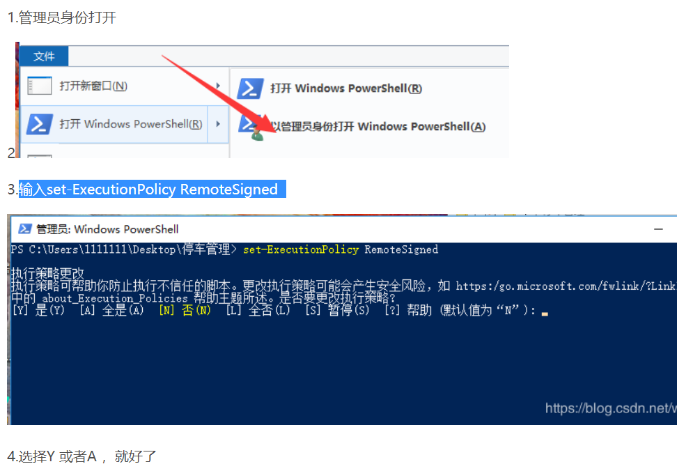
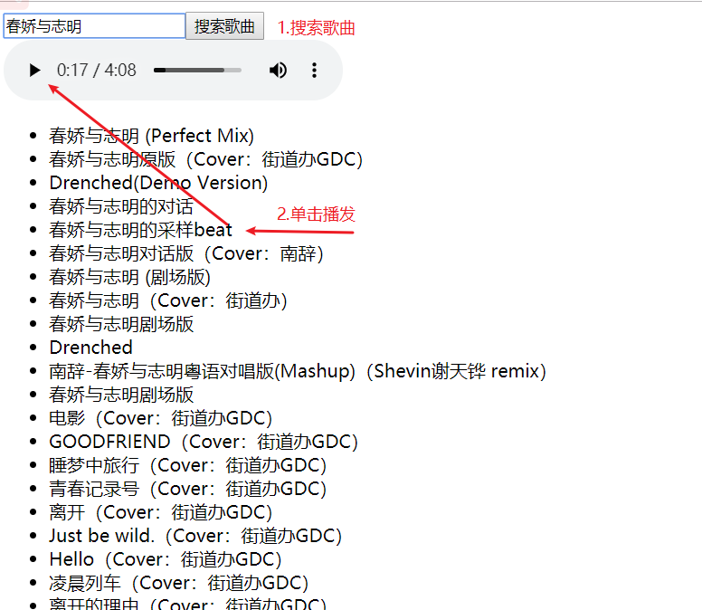

# 组件化开发


## 了解什么叫组件

> 把某个界面或者说某个小功能，封装起来就叫组件（就是对html css js的一个综合封装），组件也是Vue的实例，所以它也有自己的data和methods以及生命周期钩子等
>

**组件开发特点：**可复用，同时会简化代码结构，易于维护，同时利于多人协同开发等。


## 安装单文件组件所需要依赖

[直通车](https://cli.vuejs.org/zh/guide/prototyping.html)

**安装`vue-cli`**  脚手架

- 在cmd命令窗口输入（在任意的路径都可以）

  ```html
  npm install -g @vue/cli
  ```

  

- 安装成功检测在cmd命令窗口输入：  

  ```html
  vue -V    // 如果安装成功会返回：@vue/cli 4.0.5类似这样的版本信息
  ```

  

  

**安装出错解决方案**(如果 vue -V无法显示版本信息，说明安装失败)

- 解决方案:

  1. 更换网络环境：有线，换无线，无线换4G

  2. 更换安装的工具

     1. `cnpm安装` ：

        - 先安装淘宝镜像
        
          ```html
          npm install -g cnpm --registry=https://registry.npm.taobao.org
          ```
        
        -  cnpm安装vue-cli：
        
          ```html
           cnpm install -g @vue/cli
          ```
        
     2.  `yarn安装` :
     
        - 先安装yarn    
     
          ```html
           npm install -g yarn 
          ```
     
        -  yarn安装vue-cli
     
          ```html
           yarn global add @vue/cli
          ```
     
             

  3. 清除npm缓存之后，重新安装

     1. ```html
        npm cache clean -f      //清除npm缓存
        ```
     
        
     
     2. 重新执行安装的命令
     
     3. 在用脚手架搭建vue项目时，提示：无法加载文件 C:\Users\电脑用户名\AppData\Roaming\npm\vue.ps1,因为在此系统禁止运行脚本
     
        这是你笔记本禁止运行脚本，解决办法
     
        命令： set-ExecutionPolicy RemoteSigned  
     
        

**安装单文件组件依赖包**（安装完成vue-cli后进行这一步）

- 正常安装

```cmd
    npm install @vue/cli-service-global -g
```

- cnpm安装的用：


```cmd
    cnpm install @vue/cli-service-global -g
```

- yarn安装的用：


```cmd
    yarn global add @vue/cli-service-global
```

**注意：**如果 前面用yarn的人就一直用yarn,不要用yarn装完vue-cli,又用npm装其它插件，这样有可能 会出问题，尽量都是同步一个安装，就是以前用npm,后面就一直用npm,以前用yarn 后面就一直用yarn

## 组件结构讲解

- 把每个组件都放到一个独立的.vue文件里，

- 文件的后缀是：`.vue` 文件

- 此文件三大部分： `template` 、 `script`  、 `style`

- template

  - 写html结构的
  - 注意这里的html部分必须用一个标签全包住

- script

  - 写逻辑的，data、methods、生命周期钩子、计算属性等等代码都写在这个部分
  - 注意这里的data不再是一个对象，在组件里，data将会是一个函数,return一个对象。

- style

  - 写样式的

  - 如何 导入外部css,

    - 在css中的导入(主体使用)：

    ```css
     @import url(./babel.css);
    ```

    

- 快捷键快速生成： `<vue>`

- **单文件组件的运行**

  在cmd窗口该vue文件根目录下输入`vue serve index.vue`    这里`index.vue`是需要运行的单文件组件的路径

  ```cmd
  vue serve index.vue     
  ```

  **注意点**
  
  - template里面的html部分必须用一个标签全包住
  - 组件里没有el，组件是无需挂载到哪的，里面已经有template是它的使用的html了
  - data在组件里面是一个function,return 一个对象

```vue
<template>
  <!-- 组件html区域 
  在组件里面的html都必须有一个独立的标签包住所有标签
  -->
  <div>
    <button>按钮</button>
    <button>{{msg}}</button>
  </div>
</template>

<script>
export default {
  // 不再需要el去确定使用范围
  // 组件 里面的data将是一个函数 return一个对象
  //data:function(){return {}}
  data() {
    return {
      msg: "hello"
    };
  },
  methods: {
    alertEvent(value) {
      alert(value);
    }
  },
  created() {
      //这里面语法检测比较严格，直接写console会报错
    window.console.log(this);
    // this.alertEvent(123);
  }
};
</script>

<style>
/* 如果需要引入 外部css 
在css中的导入：
 @import url(./babel.css);
 在js中的导入
 import "./babel.css"
*/
/* @import url(./babel.css); */
@import "./babel.css";
button {
  width: 100px;
}
</style>
```


## 如何在组件中引入其它组件

>如何在一个组件中引入其它组件,实现一个组装。

**组件的使用三步**

- 1：导入组件 

  - import 自定义的一个组件名    from "组件路径";  
  - 注意点，这里组件路径就算是当前同一目录也最好加上"./组件名"，不然会报错 

- 2：注册组件

  - 组件的使用是需要注册的，注册方式为：

    ```javascript
    export default {
      components: {
        组件名,     //注册的组件都写在components对象下。
      }
    }
    ```

- 3：使用组件(写到相应html位置即可)

  ```html
      <组件名></组件名>   //该组件名来自于在组件注册时的组件名
  ```

  ```html
  <template>
    <div class="main">
      <!-- 使用组件  -->
      <!-- 在这index.vue是父组件，top，middle，bottom是子组件 -->
      <!-- top与middle是兄弟组件 -->
      <top></top>
      <middle></middle>
      <bottom></bottom>
    </div>
  </template>
  <script>
  // 导入组件  这里面top,middle,bottom是需要另外创建的vue组件，这里是没创建的
  import top from "./top.vue";
  import middle from "./middle.vue";
  import bottom from "./bottom.vue";
  
  export default {
    // 组件注册
    components: {
      top, //相当于top:top
      middle,
      bottom
    }
  };
  </script>
  <style>
  .main {
    width: 100%;
  }
  .main img {
    width: 100%;
  }
  </style>
  ```
  
  

## 组件中如何使用外部插件

**以axios为例**

使用外部插件分为三步

1. 装包（安装外部插件）

   ```html
   npm i axios //到相应目录下执行该命令    
   ```

2. 导包（在单文件组件中导入外部插件）

   ```
   import axios from "axios"
   ```

3. 用包（在相应代码位置使用）

   使用和以前一样，该怎么用还是怎么用

   ```javascript
   axios({
   url:"xxx"
   }).then(res=>{
   })
   ```

   **DEMO**
   
   ```vue
   <template>
     <div>
       <input type="text" v-model="searchValue" />
       <button @click="getMusic">点我</button>
       <ul>
         <li v-for="(item, index) in songs" :key="index">{{item.name}}</li>
       </ul>
     </div>
   </template>
   <script>
   // 使用axios   1:安装axios，npm i axios   2:导包  import axios from "axios"  3:使用
   // 导包
   import axios from "axios";
   export default {
     data() {
       return {
         searchValue: "", //input框的值
         songs: []
       };
     },
     methods: {
       getMusic() {
         // 使用，以前怎么用，现在还怎么用
         axios({
           url: "https://autumnfish.cn/search?keywords=" + this.searchValue,
           method: "get"
         }).then(res => {
           this.songs = res.data.result.songs;
           window.console.log(this.songs);
         });
       }
     }
   };
   </script>
   <style>
   </style>
   ```
   
   

## 播放器-simple

https://autumnfish.cn/search?keywords= 神话    搜索歌曲时接口获取音乐列表

https://autumnfish.cn/song/url?id=310574  获取音乐url  id来自于上一接口详情       


分析

1. 搜索功能
   1. input框：v-model   @keyup.enter="搜索事件"
   2. 搜索按钮   @click  ="搜索事件"
   3. 搜索事件
      1. 使用axios
         1. npm  i axios  安装 axios
         2. 导入axios   import axios from 'axios'
         3. 使用axios
      2. 使用axios调用接口获取歌曲列表数据
      3. 将获取到的数据渲染出来

         1. v-for
      4. 点击歌曲列表
         1. 在li上绑定点击事件
            1. @click="播放功能（传递歌曲id）"
         2. 通过点击事件查找歌曲的url
            1. axios调用接口获取歌曲url
      5. 播放歌曲

         1. 将获取到的歌曲url绑定到相应audio的src上  ：src

            

   


## 组件间的传值

>如果A组件中引入了B组件 ，这样我们称A组件为父组件，B为子组件

**父组件传值给子组件**

- 在子组件标签上定义一个ref属性

    ```html
      <组件名 ref="xxx"></组件名> 
    ```

- 在需要给子组件传值的地方写入：

  ```javascript
  this.$refs.xxx   //这就代表了子组件xxx的vue实例
  //这里xxx代码标签中定义的ref属性名这里就可访问到子组件里面的data属性与methods方法
  //如要修改子组件里面data里的某个值：          this.$refs.xxx.子组件里data属性名
  //如果需要调用子组件里面methods里某个方法：   this.$refs.xxx.子组件里面methods里方法名   
  ```

**子组件传值给父组件**

```javascript
    this.$parent    //这就代表父组件的vue实例
    //如要修改父组件里面data里的某个值：         this.$parent.父组件里data属性名
    //如果需要调用父组件里面methods里某个方法：   this.$parent.父组件里面methods里方法名   
```

注意：`ref`获取到的dom信息在这里与`document.getElementById`是有本质 区别的

```html
//两个组件，这个是father.vue
<template>
  <div>
    <button @click="btnClick">点我获取数据</button>
    <div>你选中的当前歌曲:{{localSong}}</div>
    <son ref="son" id="son"></son>
  </div>
</template>
<script>
// 组件使用，导包，注册，使用
//1：导包
import axios from "axios";
import son from "./son.vue";
export default {
  data() {
    return {
      songs: [],
      localSong: ""
    };
  },
    //2：注册
  components: {
    son
  },
  methods: {
    btnClick() {
      window.console.log("ref访问：", this.$refs.son.$el);
      window.console.log("原生访问:", document.getElementById("son"));
      //要调接口，是不是要使用axios
      //装包，导包，用包
      axios({
        url:
          "https://autumnfish.cn/search?keywords=神话&_t=" + Math.random() * 100
      }).then(res => {
        //   父组件传递子组件值，在子组件上定义一个ref,通过this.$refs.名字，我们就能访问子组件的实例，也就是可访问子组件data属性与methods方法
        this.$refs.son.songs = res.data.result.songs;
        this.$refs.son.alertEvent();
        window.console.log(res.data.result.songs);
      });
    }
  }
};
</script>
<style>
</style>
```

```vue
//son.vue
<template>
  <ul>
    <li v-for="(item, index) in songs" :key="index" @click="liCLick(item.name)">{{item.name}}</li>
  </ul>
</template>
<script>
// 子组件访问父组件里的data与methods更简单，只需要this.$parent就够了
export default {
  data() {
    return {
      songs: []
    };
  },
  methods: {
    liCLick(name) {
      this.$parent.localSong = name;
      window.console.log("访问父组件：", name, this.$parent);
    },
    alertEvent() {
      alert(123);
    }
  }
};
</script>
<style>
</style>
```


## 播放器列表组件抽取


## export与impot的基本使用

输出：export default   值

导入：import 名字  form  路径


## 音乐播放器Demo

>用单文件组件 方式实现音乐播放器，
>
>需求：音乐列表，评论列表都要抽离成单独组件。

接口：

- https://autumnfish.cn/search?keywords= 神话               搜索歌曲时接口获取音乐列表

- https://autumnfish.cn/song/url?id=310574                      获取音乐url

- https://autumnfish.cn/comment/music?id=310574         获取 用户评论列表

- https://autumnfish.cn/song/detail?ids=310574                获取 音乐详情   如图片，演唱者等

    


流程：

1. 创建app.vue，将html里面的布局移入app.vue，实现基本样式
2. 完成搜索功能
   1. input框v-model绑定，同时@keyup.enter绑定搜索事件
   2. 搜索事件调用axios
      1. 安装 axios 
      2. app.vue中导入axios
      3. 在搜索事件中调用axios获取歌曲列表
   3. 将歌曲列表抽离成组件
      1. 在components里创建一个列表组件
      2. 在app.vue中导入列表组件
      3. 注册列表组件
      4. 在html相应位置放入列表组件
   4. 通过父子传值将搜索事件中的列表数据传入列表组件 
   5. 实现歌曲播放功能
      1. 在歌曲列表里绑定事件，传入歌曲id
      2. 在app.vue中写方法调用axios获取歌曲url
      3. 在歌曲列表中调用app.vue中的方法
      4. 将歌曲获得的url绑定到audio上
   6. 实现中间动画部分功能
      1. 动画播放是通过控制 playing的class去控制的
      2. 所以在获取歌曲url后，动画就应该立马播放，所以通过v-bind控制playing为true
      3. audio有二个事件也需要控制 动画，
         1. play播放状态时，
         2. pause暂停状态时
   7. 完成评论组件
      1. 通过歌曲id获取评论接口


## 组件传值之props与emit

> 父组件通过 props 向下传递数据给子组件；子组件通过 emit 给父组件发送消息。 

- 父组件传值子组件
  - 在子组件标签上定义一个属性
    - <子组件 :`自定义属性名`=“值”></子组件>
  - 在子组件中接收数据
    - 在props中接收，props放到
      - props:['`自定义属性名`']
    - 使用传递的数据
      - this.`自定义属性名`
  - 注意点：props传递过来的数据是单向数据流，不可修改。
- 子组件调用父组件方法
  - 在子组件上定义一个方法
    - <子组件 @`自定义方法名`=“`父组件方法`”></子组件>
  - 在子组件里调用该方法
    - this.$emit("`自定义方法名`",参数)，这样就会触发`父组件方法`


