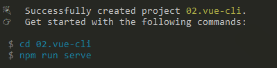
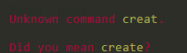
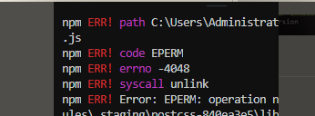
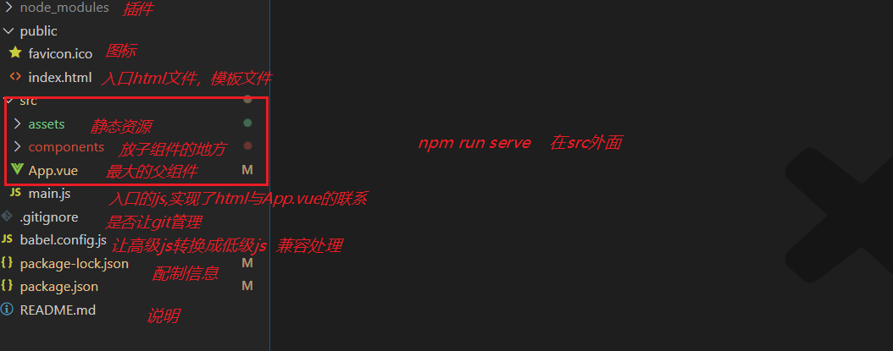

## Vue-cli项目创建

[直通车](https://cli.vuejs.org/zh/guide/creating-a-project.html#vue-create)

### 什么是脚手架

- 脚手架就是个项目模板 ， 相当于把整个文件基本目录结构搭好了，把必要的文件也建好 了，让我们省了很多事情。

### **创建项目：**

2. 创建时路径不要选错，就是命令的路径要是需要创建项目的文件夹下

   - 完美选择不出错路径方法：在文件夹相应路径下的地址栏输入cmd ---再 回车

3. 运行创建命令

   ```html
   vue create 项目名      //这里项目名不要有中文，不要有大写字母，不要搞特殊符号，尽可能有意义 ，像普通变量命名一样
   ```

   

4. 弹出的对话框先选择默认的选项（如下图）

   - 

5. 稍等一会，等进度条走完 提示如下画面说明成功了,如下图：

   - 

6. 进入项目文件夹(就是项目名的文件夹)

   - `cd 项目名` 直接根据提示即可 

7. 运行项目

   - ```html
     npm run serve
     ```

8. 稍等片刻 ，出现如下效果说明成功了

   


### 报错的原因：

1. 

   创建的命令输入错误`create`输入成了`creat`

2. 

   1. 网络问题，有线换无线，无线换4G
   2. 终端的权限问题；新建管理员模式的终端
   3. 当前这个文件夹，这个文件被其他软件占用：关闭所有可能影响的软件（重启）
   4. npm包管理工具的问题:（前面安装时已做说明）
      1. 用yarn来安装
      2. 执行``npm cache clean -f`` 在重新创建项目

3. 

   创建项目时，用到了第三方模块，文件太多了git人为没有必要管，提示你一下，选择不再显示就OK了

   vue-cli创建项目时，已经设置了git忽略文件 就在`.gitignore`中


### 实在无法创建项目的解决方案（重要）

1. vue-cli创建项目的本质是：
   1. 创建文件夹
   2. 下载第三方模块
   3. 创建项目的基本结构
   4. 设置各个文件之间的关系
   5. 创建git仓库
2. 找一个可以创建项目的人，创建一个项目
   1. 删除`node_modules`
   2. 发给你
   3. 你使用`npm i `安装项目中用到的第三方模块
   4. 运行项目`npm run serve`

## Vue-cli项目结构

**项目结构说明：**



- node_modules       第三方模块包，也就是项目所需要用到的依赖包
- public
  - favicon.ico     运行项目时在网页上显示 的小图标
  - index.html      项目的页面模板 ，也就是项目运行最开始，是先执行这个模板html的
- src                            项目开发主体就是在这个src目录下面
  - assets               项目所需要的静态资源，如css,图片等文件
  - components     项目中的单文件组件都放这里
  - App.vue             入口组件 ，可以理解为一个项目就是一个app.vue的单文件组件，只不过里面包括了很多小组件
  - main.js              入口js文件，进入项目会优先执行main.js以此来运行app.vue
- .gitignore                让git忽略某些文件，文件夹
- babel.config.js           js编译的设置，比如把高版本的js转为低版本的js,让项目达到更好兼容性
- package-lock.json     项目模块详细信息，包括来源。
- package.json              项目基本信息
- README.md                项目说明

## Vue-cli 入口文件main.js分析

1. main.js中
   1. 创建了最外层的Vue实例
   2. 把App.vue这个组件，当做Vue实例内部的最顶级组件并渲染出来
   3. 和public/index.html 中的那个id为`app`的div关联起来


## css作用域控制 

1. scoped处理css,让它作用域只是相对自己当前组件，不包括自己子组件，但同时可控制子组件最外层的标签样式
2. 简单理解 就是加了scoped就是只是作用于当前自己这个vue文件，不包括其它任何文件（但当前自己组件的子组件的最外层还是可以控制到），但不加就会造成在使用该组件时，它里面的样式就变成了全局样式，


## 路由是什么

>路由其实就是一个指向，把路径指向相应的组件地址


## 路由效果演示

>能够实现路由基本跳转，不同地址对应不同组件内容


## 路由的基本使用

>在vue中要实现路由是vue-router来实现

1. 安装插件（注意在项目所在目录进行安装）

   - ```html
     npm i vue-router
     ```

2. 导入插件

   - 在哪里导入插件呢？vue-router是vue的一个插件，也是一个全局的控制 ，所以最终是要挂载到new Vue上的,new Vue是在main文件中执行的，所以vue-router也就得在main文件中导入

   - ```javascript
     import  VueRouter  from  'vue-router'
     ```

3. 注册插件

   - 在vue中，router在vue中要全局使用，是需要注册才行的

   - ```vue
      Vue.use(VueRouter) 
     ```

4. 实例化router

   - ```javascript
      let router = new VueRouter({  })    //router实例化
     ```

   - ```javascript
     //配制router使用规则 
      let router = new VueRouter({  
       routes:[ // 路由规则配置，我们说了，路由就是一个地址与组件的一个指向，这个规则就是配制在这里的
           {
           path: 地址路径，    //这里配制一个路径地址
           component: 组件名   //这里对应一个.vue组件 ，也就是import一个组件，在这对应上
           }
           ] 
      })
     ```

5.  把实例注入到 new Vue 

   - ```javascript
      new Vue({
      router    //这里的router就是上面所实例化的router
      })
     ```

6. 路由出口，告诉router，需要把组件渲染在哪一个位置

      app.vue中写上一个标签，<router-view></router-view>

      router-view标签将来会被匹配到的路径对应的组件替换掉

   **main.js中加入router写法代码**

   ```javascript
   import Vue from 'vue'
   import App from './App.vue'
   // 1:导入vue-router
   import VueRouter from "vue-router"
   //这里Home是自己components下创建的一个组件 
   import Home from "./components/Home"
   // 2:注册vue-router
   Vue.use(VueRouter)
   // 3:实例化vue-router
   const router = new VueRouter({
     // 配制vue-router
     routes: [
       {
         path: "/home",     //路径地址
         component: Home    //路径地址所对应的组件
       }
     ]
   
   })
   Vue.config.productionTip = false
   
   new Vue({
     render: h => h(App),
     router    //4:注入到new Vue实例里面
   }).$mount('#app')
   
   ```

## router-link的基本使用

用法:

```
<router-link to='/foo(路径)'>跳转至foo</router-link>
//相当于a标签   <a href="#/foo">跳转至foo</a>
//router-link相当于a标签的一种vue写法写法
```


## 编程式导航

>更灵活的控制路由跳转

**用法**

```javascript
this.$router.push('路径')   //这里的路径就是前面路由routes所配制的path
```


**作用**

用js编写路由跳转来实现页面切换


## 路由实现原理

实际就是通过hash值变化实现了组件控制


## 黑云音乐demo

>展示

-  http://183.237.67.218:3000/banner                                          获取轮播图图片接口地址
-  http://183.237.67.218:3000/search?keywords= 神话               搜索歌曲时接口获取音乐列表
-  http://183.237.67.218:3000/song/url?id=310574                      获取音乐url
-  http://183.237.67.218:3000/comment/music?id=310574         获取 用户评论列表
-  http://183.237.67.218:3000/song/detail?ids=310574                获取音乐详情如图片，演唱者等
-  http://183.237.67.218:3000/lyric?id=310574                              获取歌词
-  http://183.237.67.218:3000/mv/detail?mvid=  mvid                 获取歌曲视频
-   http://183.237.67.218:3000/ 


## 在vue-cli中使用elementUI

>学习elementUI在vue中的使用，如何快速完成网站搭建
>
>让我们写更少的js代码，更少的css,拿过来就用

[直通车](https://element.eleme.cn/#/zh-CN/component/installation)

1. 装包（安装elementUI）

   - ```html
     npm i element-ui -S
     ```

2. 导包（因为elementui也有css，所以css也需要导入）

   - ```javascript
     //在main.js中导入以便全局使用
     import ElementUI from 'element-ui';
     import 'element-ui/lib/theme-chalk/index.css';
     ```

3. 注册

   - ```javascript
     Vue.use(ElementUI);
     ```

4. 使用。

   - 在需要使用elementui的组件里面按官网用法复制代码进去使用。


## element轮播图

1. 创建vue-cli    vue create 项目名

2. 安装elementui

3. 导入elementui

   1. ```
      // 导入组件与css
      
      import ElementUI from 'element-ui';
      
      import 'element-ui/lib/theme-chalk/index.css';
      
      // 注册
      
      Vue.use(ElementUI);
      ```

4. 使用组件

   1. 复制粘贴


## 黑云音乐轮播图

>用elementUI与axios完成一个轮播图开发

获取轮播图图片接口地址：https://autumnfish.cn/banner?sdgsdg=Math.random()*999


## 路由传值

> 当我们进行路由跳转时，时常是需要带一些参数过去的。

1. **传参**（在需要跳转路由的页面跳转路由时传递参数）

   - ```javascript
     二种写法：
     1：配制写法
     this.$router.push({
     path:"路径xxx",
     query:{
     //这里的query就好比在url上串了一些参数，类似于接口get请求传参
     name:"xxx"
     }
     })
     2：路径拼接写法，类似于get请求
     this.$router.push("路径?name=xxx")
     ```

2. **接参**（接收参数是在路由跳转到xxx组件后，在xxx组件里面接收）

   - ```javascript
     this.$route.query.name      //这里就可以收到whis.$router.push传递过来的参数了  
     //在相应组件接收参数
     ```

## $router与$route的区别

- $router相当于整个路由的管理者，是做整个路由管理工作的，能实现路由跳转之类的事情
- $route只是当前路由的一些基本路由信息的获取 ，只是当前自己所在的一条路由的基本信息


## 过滤器的基本使用

>有的时候，有些数据没法直接拿来用，就需要对这些数据进行过滤处理，过滤器就是用来做这个功能的

- **全局过滤器** （ 全局过滤器定义后，所有组件都可使用）

  - 定义（在main.js中做全局定义）

    - ```javascript
      //value是过滤器的要过滤的值，这里return的值就是最终过滤器的值 
      Vue.filter("过滤器名字",function(value){
        return  返回值        
      })
      ```

  - 使用

    - ```javascript
      //这里的value就是过滤器方法里面的参数，也就是要过滤的值
      <div class="time">{{value | 过滤器名字 }}</div>
      ```

- **局部过滤器**（只能应用于当前组件）

  - 定义（在自己所在组件里面定义）

    - ```javascript
      //上面的value是过滤器的要过滤的值，return的值就是过滤器定义的结果
      filters: {
          过滤器名字(value) {
            return 返回值 
          }
        }
      
      ```

  - ```css
    //这里的value就是过滤器方法里面的参数，也就是要过滤的值
    <div class="time">{{value | 过滤器名字 }}</div>
    ```

  **作用：**平时项目中用的较多的，就是对一些字符串加工之类的，如：接口传了你一个时间戳，你需要转换成相应的正常时间格式等。        

**Demo**

```vue
<template>
  <div>{{time | formatTime}}</div>
</template>
<script>
export default {
  data() {
    return {
      time: "1546275661000"
    };
  },
  filters: {
    formatTime(str) {
      let _date = new Date(+str);
      let _year = _date.getFullYear();
      let _month = ("0" + _date.getMonth() + 1).slice(-2);
      let _day = ("0" + _date.getDate()).slice(-2);
      let _h = ("0" + _date.getHours()).slice(-2);
      let _m = ("0" + _date.getMinutes()).slice(-2);
      let _s = ("0" + _date.getMinutes()).slice(-2);
      return (_year + "-" + _month + "-" + _day + "  " + _h + ":" + _m + ":" + _s
      );
    }
  }
};
</script>
<style>
</style>
```


## moment

基本使用：moment().format("YYYY年MM月DD日  HH:mm:ss")

取当前时间并按某格式输出 ： moment().format("时间格式")

给出一个毫秒时间，并按某格式输出 

​                 moment(毫秒时间).format("时间格式")

- Y年   M月   D日    
- H小时，以24小时计   h以12小时计
- m分钟    s 秒

官方文档： [http://momentjs.cn/docs/#/parsing/string/]( http://momentjs.cn/docs/#/parsing/string/ ) 


## es6对象方法

Object.keys(对象)    :将对象的key值转换成数组

 Object.values(对象)    :将对象的value值转换成数组

Object.entries(对象)  :将对象的key值和value值转换成数组 （一个二维数组）

for  of进行一个循环处理

 Object.assign(最终合并对象{},需要被合并的对象{},......) 

用于多个对象的合并，并返回一个合并后的对象


## axios基地址配制与全局调用

- // 基地址设置

- axios.defaults.baseURL='http://183.237.67.218:3000'

  //会自动判断 axios的url前面是否有http地址，如果没有，它会加到前面，如果有了，它就不加了

- 

- 在vue原型上加入$axios,让Vue的所有实例都可以调用该axios

- Vue.prototype.$axios=axios 


## 路由重定向

当访问的某些地址没有在路由中配置时，让它指向一个固定path

```
new VueRouter({
routes:[
{
   //路由重定向： 匹配不到的地址，我们让它跳转至哪里，这里redirect后面的地址就是重定向去的地址
      path: "*",  //需要重定向的地址
      redirect: "/"  //重定向到哪里去
}
]
})
```


## 路由抽取成单独js文件


## 生命周期之beforeDestroy与destroyed

beforeCreate:创建前，它不能访问访问data与methods

created:创建后，它可以访问data与methods,但是还不能访问vue渲染后的dom

beforeMount:渲染前，它还不能访问vue渲染后的dom

mounted:渲染后，它可以访问vue渲染后的dom

beforeUpdate:更新前，数据已修改，但是页面还没有完成渲染

updated:更新后，数据已修改，且页面已完成渲染

beforeDestroy:销毁前，啥都可以访问，但是准备要销毁了，一般用于善后工作

destroyed:销毁后，中止了渲染，但是还是可以访问data再来methods,但是不能访问vue渲染后的dom,还是可以做善后工作


## export，   export default，   import的基本使用

export default 一个js里只能写一个 

export default 它配套的import不用写import {}它是import 名字  from 路径

export  配套的import  import {名字（export 中对应的名字）}  from "路径"

但是export 可以写多个

使用exporrt default导出的值，在import 名字  from "路径",这个名字可以随便定义

但是使用export 导出的值，在import {名字} from "路径"  这里的名字必须和export的名字对应上


