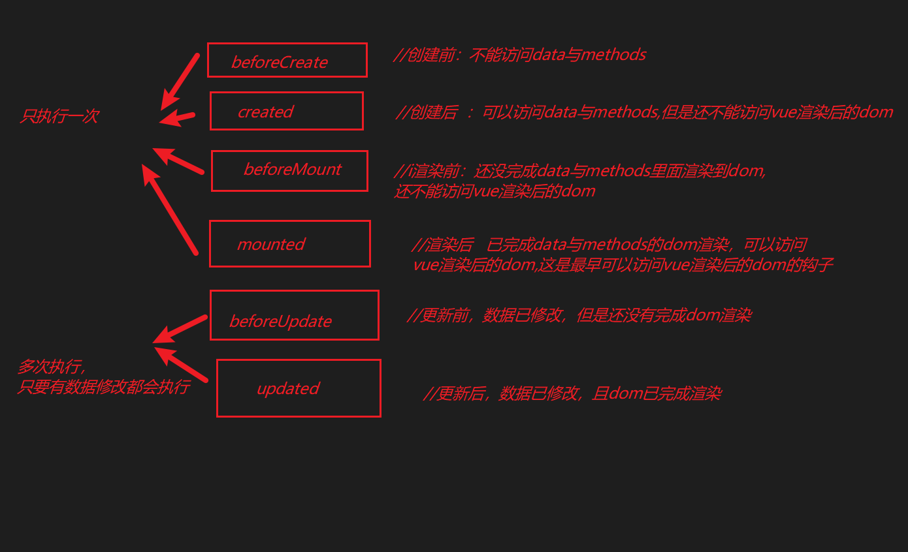

# 其它知识点


## vue生命周期

[直通车](https://cn.vuejs.org/v2/guide/instance.html#%E7%94%9F%E5%91%BD%E5%91%A8%E6%9C%9F%E5%9B%BE%E7%A4%BA)



> `beforeMount`:渲染前，被vue管理起来的dom在vue实例里还没完成渲染，所以就是还不能访问vue渲染的dom,平时项目中基本用不到，知道有这个是干什么的就行。
>
> `mounted`:渲染后，数据已在vue实例中渲染完成，也就是可以访问vue渲染的dom了，很常用的一个勾子，一定要记住。
>
> `beforeUpdate`:更新前，当数据发生改变，但页面还没完成更新，但快要更新时调用，没什么用。
>
> `updated`:更新后，当数据发生改变，且页面完成了更新后调用，也用的很少。

**用法：**

它是用在vue实例化里面的,所有的生命同期都是一个函数 ，写到vue里就可以。

```javascript
new Vue({
  el: '#app',
  methods: {
  },
  beforeCreate(){//创建前，还不能访问data与methods},
  created(){//创建后，能访问data与methods},
  beforeMounte(){//渲染前,被vue管理的dom还没完成在vue实例内的渲染，所以还不能调用dom},
  mounted(){//渲染后，被vue管理的dom已完成vue实例内的渲染，所以现在可以调用dom},
  beforeUpdate(){//更新前，当数据发生改变，但页面还没完成更新时调用。},
  updated(){//更新后，数据发生改变，且完成了页面更新时调用。}
})
```

**功能：**  

- `beforeMount`:基本没啥用。
- `mounted`:能调用dom，后面用到使用一些第三方插实例化时要调用dom时使用等，这个方法是很常用的
- `beforeUpdate`:基本没啥用。
- `updated`:基本没啥用。实际使用中，因为太多的数据发生改变了，他是在不停的调用的，所以，如果使用它会造成很多性能问题。

注：这里面我们重点需要知道二个生命周期勾子（created与mounted），但是其它勾子我们虽然 基本不怎么用，但需要记住它的功能，这个面试时，基本算是一个必问题了。

来一个demo让大家清晰一下这个过程

```html
<!DOCTYPE html>
<html lang="en">

<head>
    <meta charset="UTF-8">
    <meta name="viewport" content="width=device-width, initial-scale=1.0">
    <title>Document</title>
</head>
<body>
    <div id='app'>
        {{name}}
        <button @click="changeData">改变数据</button>
    </div>
    <script src='https://cdn.jsdelivr.net/npm/vue/dist/vue.js'></script>
    <script>
        new Vue({
            el: '#app',
            data: {
                name:'laijunfa'
            },
            methods: {
                show(){
                    console.log('你好');
                },
                changeData(){
                    this.name="laijunfa2"
                }
            },
            //vue生命周期

            beforeCreate() {
                //创建前不能访问data和methods
                console.log('beforeCreate创建前');
                console.log("data",this.$data);
                console.log("methods",this.$methods);
            },
            created() {
                // 创建完成可以访问data和methods,但还没渲染
                console.log('created创建完成');
                console.log('el',this.$el);
                console.log('data',this.$data);
                console.log('methods',this.$methods);
                this.show();
            },
            beforeMount() {
                //DOM未完成挂载，数据也初始化完成，但是数据的绑定还是显示{{}}
                console.log('beforeMount挂载前');
                console.log('el',this.$el);
                console.log('data',this.$data);
            },
            mounted() {
                //dom完成挂载,数据渲染完成
                console.log('mounted挂载完成');
                console.log('el',this.$el);
                console.log('data',this.$data);
            },
            //页面数据改变都会触发beforeUpdate,updated
            beforeUpdate() {
                //更新前，当数据发生改变，但页面还没完成更新时调用
                console.log('beforeUpdate 数据更改前');
                console.log('el',this.$el.innerHTML);
                console.log('data',this.$data);
            },
            updated() {
                //更新后，数据发生改变，且完成了页面更新时调用。}
                console.log('updated 数据更改完成');
                console.log('el',this.$el.innerHTML);
                console.log('data',this.$data);
            },
        })
    </script>
</body>

</html>
```


## IScroll基本用法

>滚动条的优化

[直通车](http://caibaojian.com/iscroll-5/gettingstart.html)

**用法**

1. 导包，引入iscroll.js   （包已在学习资料里发给大家）

2. 布局，写好html与对应css

   1. html需要写三层布局，第 一层是用于iscroll使用范围，第二层是滚动内容

      ```html
          <div id="box" >
              <div id="ul">
                  <p>隔壁老王1</p>
                  <p>隔壁老王2</p>
                  <p>隔壁老王3</p>
                  <p>隔壁老王4</p>
                  <p>隔壁老王5</p>
                  <p>隔壁老王6</p>
                  <p>隔壁老王7</p>
                  <p>隔壁老王8</p>
              </div>
          </div>
      ```

   2. css处理

      ```css
               #box{
                   border: 1px solid #000;
                   /* 给div限制一个高度 */
                   height: 100px;
                    /* 这里一定要加一个定位，因为iscroll定位用的是绝对定位，它滚动条的位置是用的绝对定位 */
                   position:relative;
                   /* 用了iscroll就没必要系统自己的滚动条了，不然会有冲突了，所以一般是用hidden */
                   overflow: hidden;
               }
      ```

3. iscroll实例化

   ```javascript
   //IScroll来自于js包，后面#wrapper是一个选择器，也就是确定使用范围
   var myScroll = new IScroll('#wrapper', {
       // 这里是配制项，官网有很多配制，我下面列举了二项
       mouseWheel: true,   //鼠标滚轮配制
       scrollbars: true    //滚动条的显示配制
   });
   ```

   

**作用:**对项目中使用的滚动条进行优化，如，滚动条样式，效果，功能等方面的优化。


```html
<!DOCTYPE html>
<html lang="en">

<head>
    <meta charset="UTF-8">
    <meta name="viewport" content="width=device-width, initial-scale=1.0">
    <meta http-equiv="X-UA-Compatible" content="ie=edge">
    <title>Document</title>
</head>
<style>
    * {
        margin: 0;

    }

    #app {
        width: 300px;
        height: 150px;
        border: 1px solid red;
        /*去掉以前默认滚动条  */
        overflow: hidden;
        /* 让iscroll的滚动条的定位相对于该class */
        position: relative;
    }
</style>

<body>
    <!-- 布局 -->
    <button id="btn">增加li</button>
    <div id="app">
        <ul id="ul">
            <li>隔壁老王1</li>
            <li>隔壁老王2</li>
            <li>隔壁老王3</li>
            <li>隔壁老王4</li>
            <li>隔壁老王5</li>
            <li>隔壁老王6</li>
            <li>隔壁老王7</li>
            <li>隔壁老王8</li>
        </ul>
    </div>
    <!-- 导包 -->
    <script src="./iscroll.js"></script>


    <!-- 实例化 -->
    <script>
        var wrapper = document.getElementById('app');
        var myScroll = new IScroll(wrapper, {
            mouseWheel: true,     //鼠标滚轮 控制
            scrollbars: true      //显示滚动条
        });
        let _btn = document.getElementById("btn")
        btn.onclick = function () {
            let _li = document.createElement("li")
            _li.innerHTML = "xxx测试"
            let _ul = document.getElementById("ul")
            _ul.appendChild(_li)
            // 刷新iscroll，让它重新计算高度，因为dom已改变，iscroll要重新计算滚动范围那些
            myScroll.refresh()
        }

    </script>
</body>

</html>
```


## iscroll在vue中基本用法

>iscroll在vue中如何使用呢？

**注意点**

- `iscroll`实例化时得在`mounted`里面，因为`iscroll`实例化得调用`vue`的`dom`，`mounted`是生命周期里第一个可访问`dom`的
- 使用`iscroll`刷新数据时，加入了`setTimeout`,因为vue中数据改变到更新到页面，是有很多代码要执行的，是需要时间的，、而`iscroll`刷新时要获取 最新`dom`高度等信息处理，所以一定要在dom更新完成时使用。

```html
<!DOCTYPE html>
<html lang="en">

<head>
    <meta charset="UTF-8">
    <meta name="viewport" content="width=device-width, initial-scale=1.0">
    <meta http-equiv="X-UA-Compatible" content="ie=edge">
    <title>Document</title>
</head>
<style>
    * {
        padding: 0;
        margin: 0;
    }

    .wrapper {
        width: 200px;
        height: 150px;
        border: 1px solid red;
        overflow: hidden;
        position: relative;
    }
</style>

<body>
    <div id="app">
        <button @click="btnClick">点我啊</button>
        <div class="wrapper" ref="wrapper">
            <ul id="ul">
                <li v-for="(item, index) in liData" :key="index">{{item}}</li>
            </ul>
        </div>
    </div>
    <script src="./vue.js"></script>
    <script src="./iscroll.js"></script>
    <script>
        new Vue({
            el: "#app",
            data: {
                iscroll: '',
                liData: ["隔壁老王", "隔壁老王", "隔壁老王", "隔壁老王", "隔壁老王"]

            },
            methods: {
                btnClick() {
                    // let _li = document.createElement("li")
                    // _li.innerHTML = "xxx测试"
                    // let _ul = document.getElementById("ul")
                    // _ul.appendChild(_li)
                    // this.iscroll.refresh()
                    this.liData.push("xxx测试")
                    // 以后使用setTImeout尽量使用箭头函数，不然this问题会有影响
                    setTimeout(() => {
                        this.iscroll.refresh()
                    }, 0);


                }
            },
            beforeCreate() {

            },
            created() {

            },
            beforeMount() {

            },
            mounted() {
                // 在mounted中实例化iscroll是因为iscroll是第一个最早可以访问vue的dom的生命周期
                this.iscroll = new IScroll(this.$refs.wrapper, {
                    mouseWheel: true,     //鼠标滚轮 控制
                    scrollbars: true      //显示滚动条
                })

            },
            beforeUpdate() {
                // 一定要是有vue里面数据的修改，它才会触发
                console.log(123);


            },
            updated() {

            },
        })
    </script>
</body>

</html>
```


## 优化英雄选择demo加入iscroll

>优化英雄选择demo列表，加入iscroll滚动条功能


## 单元素的动画

>vue中是如何实现动画的呢？

[直通车](https://cn.vuejs.org/v2/guide/transitions.html)

   实现动画只能在：显示和隐藏    v-show   v-if

**用法**     

- **html部分的处理**

  - 用transition把要动画的元素包起来，给一个name值，name值其实就是后面动画css里面的class前缀

  - ```html
            <transition name="xxoo">
                <div class="box" v-if="isShow"></div>
            </transition>
    ```

    

- **css部分的处理**

  - xxoo-enter-active与xxoo-leave-active只是实现动画transition的一个class,只是为了执行transition动画,可以设置transition相关属性

  - xxoo-enter就是单元素进入前的状态也就是进入时需要是什么样子，

  - xxoo-leave-to就是离开时需要变成什么样的样式

  - ```css
        .xxoo-enter-active,
        .xxoo-leave-active {
            transition: all 2s;
        }
        //这里的xxoo-enter就是进入前的样式
        //这里xxoo-leave-to就是离开后需要变成什么样的样式
        .xxoo-enter {
            opacity: 0;
            transform: translateX(-600px);
        }
    
        .xxoo-leave-to
            {
            opacity: 0;
            transform: translateX(600px);
        }
    ```

    

**作用：**对单元素实现一个进入或者离开时的一个动画效果处理，一般是v-if 与v-show对单元素操作时的动画


```html
<!DOCTYPE html>
<html lang="en">

<head>
    <meta charset="UTF-8">
    <meta name="viewport" content="width=device-width, initial-scale=1.0">
    <meta http-equiv="X-UA-Compatible" content="ie=edge">
    <title>Document</title>
</head>
<style>
    .xxx-enter-active,
    .xxx-leave-active {
        /* 动画的实现者 */
        /* 实现动画，透明度的，时间0.5秒 */
        transition: all .5s;
    }

    /* 进入前的状态 */
    .xxx-enter {
        opacity: 0;
        transform: translatex(-200px);
    }

    /* 离开后的最后那一瞬间的状态 */
    .xxx-leave-to {
        opacity: 0;
        transform: translatex(200px);
    }

    p {
        width: 100px;
        height: 100px;
        margin: 0 auto;
        background-color: #f40;
    }
</style>

<body>
    <div id="demo">
        <button v-on:click="show = !show">
            Toggle
        </button>
        <!-- 要做单元素动效一定要用transition包住，同时给一个name,name里的值就是对应class的前缀 -->
        <transition name="xxx">
            <p v-if="show">hello</p>
        </transition>
    </div>
    <script src="./vue.js"></script>
    <script>
        new Vue({
            el: '#demo',
            data: {
                show: true
            }
        })
    </script>
</body>

</html>
```


## transition与keyframes的结合动画使用

**用法**   keyframes用法实际 和常规css写法基本一样的了，这里简单说明一下

- html部分，和单元素动画里面一样

  - ```html
    //把要实现单元素动画的标签用transition包起来，给一个name=xxx，这里的name就是需要实现动画的css前缀。
            <transition name="xxoo">
                <div class="box" v-if="isShow"></div>
            </transition>
    ```

- css部分

  - ```css
     //这里面就是对keyframes动画表现部分,实际就是为了使用一个animation
        .xxoo-enter-active,
        .xxoo-leave-active {
            animation:动画名称 时长;    //这里就是animation的用法一样
        }
    //下面就是基本的keyframes的写法
        @keyframes 动画名称 {
            0%{
                width:0px;
            }
            100%{
                width:200px;
            }        
        }
    ```

    

**作用**     用keyframes结合transition去实现动画效果

```html
<!DOCTYPE html>
<html lang="en">

<head>
    <meta charset="UTF-8">
    <meta name="viewport" content="width=device-width, initial-scale=1.0">
    <meta http-equiv="X-UA-Compatible" content="ie=edge">
    <title>Document</title>
</head>
<style>
    * {
        margin: 0;
        padding: 0;
    }

    p {
        width: 100px;
        height: 100px;
        background-color: #f00;
        margin: 0 auto;
    }

    /* 这里.xxx-enter-active与.xxx-leave-active和前面一样,都是动画的执行者 */
    .xxx-enter-active {
        animation: move 0.5s;
    }

    .xxx-leave-active {
        animation: move2 0.5s;
    }


    @keyframes move {
        0% {
            opacity: 0;
            width: 0;
            height: 0;
            background-color: #fff;
        }

        100% {
            width: 100px;
            height: 100px;
            background-color: #f00;
        }
    }

    @keyframes move2 {
        0% {
            width: 100px;
            height: 100px;
            background-color: #f00;
        }

        100% {
            width: 500px;
            height: 500px;
            opacity: 0;
            background-color: #00f;
        }
    }
</style>

<body>
    <div id='app'>
        <button @click="isShow=!isShow">点我切换</button>
        <transition name="xxx">
            <p v-if="isShow"></p>
        </transition>

    </div>
    <script src='./vue.js'></script>
    <script>
        new Vue({
            el: '#app',
            data: {
                isShow: true
            }
        })
    </script>
</body>

</html>
```


## 多元素动画

> 多元素动画必须用transition-group包住,且每个子元素必须设置一个key，其它和单元素动画是一样的

```html
<!DOCTYPE html>
<html lang="en">

<head>
    <meta charset="UTF-8">
    <meta name="viewport" content="width=device-width, initial-scale=1.0">
    <meta http-equiv="X-UA-Compatible" content="ie=edge">
    <title>Document</title>
</head>
<style>
    p {
        width: 150px;
        height: 150px;
        background-color: #f40;
        margin: 0 auto;
    }

    p:nth-child(1) {
        transition-delay: 0s;
    }

    p:nth-child(2) {
        transition-delay: 0.3s;
    }

    .xxxooo-enter-active {
        transition: all .5s;
    }

    .xxxooo-enter {
        opacity: 0;
        width: 0;
        height: 0;
    }
</style>

<body>
    <div id='app'>

        <button @click="isShow=!isShow">点我切换</button>
        <!-- 加入transition -->
        <!-- 多元素动画必须用transition-group包住
             每个子元素必须设置一个key值以便vue识别     
             其它使用和单元素一样   
        -->
        <transition-group name="xxxooo">
            <p v-if="isShow" key="1"></p>
            <p v-if="isShow" key="2"></p>
        </transition-group>


    </div>
    <script src='./vue.js'></script>
    <script>
        new Vue({
            el: '#app',
            data: {
                isShow: true
            }
        })
    </script>
</body>

</html>
```


## 补充知识点：includes、map、filter、findIndex

includes:适用与数组与字符串

1. 数组：返回值= 数组.includes(值)   判断值是不是在数组中，
   1. 在就  返回值=true,不在  返回值=false
2. 字符串和数组一样用法
   1. 返回值=字符串.includes(值)   判断 值在不在字符串中

map的基本用法

1. 用法：返回新数组=数组.map((item,index)=>{return 值}) 
   1. map里面的function中return的值就是返回新数组中的每一个项
   2. 如果没有写return值，它就默认为是return了undefined

filter的基本用法

1. 用法:  返回新数组=数组.filter((item,index)=>{ return boolean值})
2. 如果boolean值为true,新数组中就push(item(返回为true的这个项的值))
3. 如果boolean为false，新数组中就不push该项

findIndex的基本用法

1. 用法:返回值=数组.findIndex((item,index)=>{return boolean值})
2. 如果boolean值为true  返回值就为该项的index,同时中止循环
3. 如果boolean值为false,就继续往下找，直到有boolean值为true
4. 如果所有项都是false,则返回值为-1


## 补充：关于事件中的$event

每个点击事件里面都有一个事件对象，在vue中如何去使用该事件对象呢？

```
        <!-- <button @click="btnClick">点我啊</button> -->
        <!-- btnClick($event)这才是完整写法 
        $event：事件对象，也就是事件驱动源
        如果事件后面带括号，需要使用事件对象，就一定要在括号里面传入实参$event
        如果事件后面没有括号，vue帮我们默认传递了实参$event
        -->
```


## 天知道demo分析


http://wthrcdn.etouch.cn/weather_mini        参数：city      get请求

分析

1. 处理搜索
   1. input
   2. 按钮
   3. 搜索事件
      1. axios接口获取天所数据
      2. 渲染天气数据
         1. 天气图标   用v-if处理
   4. 处理动画，多元素动画
      1. 进入与离开处理
         1. []=》[有数据的数组]    v-if="false"  =>  v-if="true"
         2. axios加载过程前  [有数据的数组] =》[]   v-if="true"   =》v-if="false"
2. 快捷搜索
   1. 改变input框的值
   2. 触发搜索


